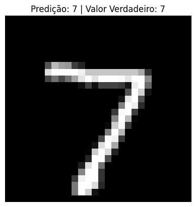

# Classificação de Dígitos com Rede Neural Convolucional (CNN)

Este projeto usa uma **Rede Neural Convolucional (CNN)** para classificar imagens de dígitos manuscritos do dataset **MNIST**. A rede é treinada para prever os números de 0 a 9 a partir das imagens, e a implementação utiliza o **Keras** e o **TensorFlow**.

## Estrutura do Projeto

- **`notebooks/`**: Contém notebooks Jupyter, treinamento do modelo e avaliação de desempenho.
- **`imagens_previsoes/`**: Diretório onde as imagens de previsão são salvas.
- **`README.md`**: Este arquivo.

### Dependências
Este projeto utiliza as seguintes bibliotecas:
- `tensorflow` (Keras)
- `numpy`
- `matplotlib`
- `pandas`
- `plotly`

## Descrição

O objetivo deste projeto é classificar imagens de dígitos manuscritos utilizando uma Rede Neural Convolucional (CNN). O dataset utilizado é o **MNIST**, que contém 60.000 imagens de treinamento e 10.000 imagens de teste.

O modelo foi treinado e avaliado usando as seguintes etapas:
1. **Pré-processamento**:
   - Normalização das imagens (de valores entre 0 e 255 para valores entre 0 e 1).
   - Conversão dos rótulos para **one-hot encoding**.
   
2. **Criação da CNN**:
   - Duas camadas de convolução seguidas de camadas de pooling.
   - Camada **Flatten** para achatar as imagens e passá-las para uma camada **Dense** totalmente conectada.
   - Camada de saída com **softmax** para classificação em 10 classes.

3. **Treinamento**:
   - O modelo foi treinado por 5 épocas com o otimizador **Adam** e a função de perda **categorical crossentropy**.

4. **Avaliação**:
   - O modelo foi avaliado utilizando o conjunto de teste, e a acurácia foi reportada.
   
5. **Predições**:
   - O modelo faz previsões sobre as imagens de teste e exibe as imagens com suas predições e valores reais.
   
    
   
   
   
   

## Exemplos de Saída

Durante a execução dos scripts de previsão, as imagens de teste serão exibidas com títulos que mostram a predição e o valor verdadeiro. Aqui está um exemplo do título exibido para cada imagem:

## Contribuição

Se você quiser contribuir para este projeto, sinta-se à vontade para fazer um fork do repositório, criar uma branch e enviar um **pull request**. Fique à vontade para melhorar o código ou adicionar novos recursos!

## Licença

Este projeto está licenciado sob a **MIT License** - veja o arquivo [LICENSE](LICENSE) para mais detalhes.
